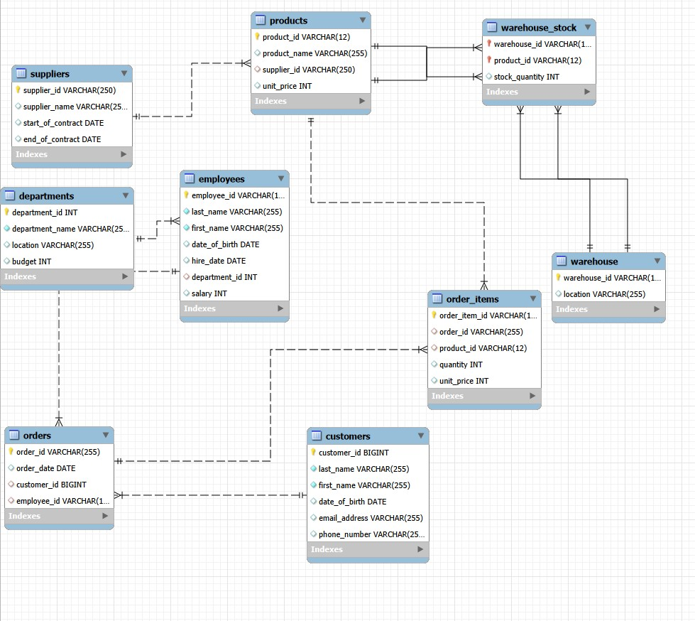
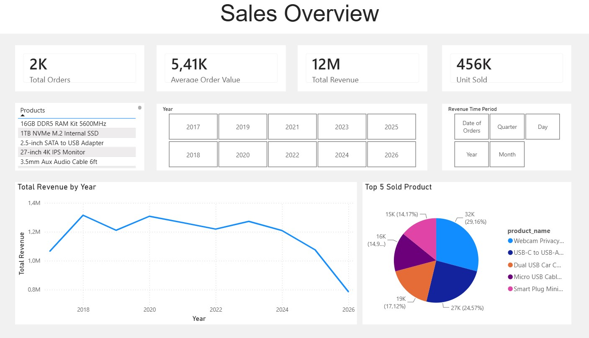
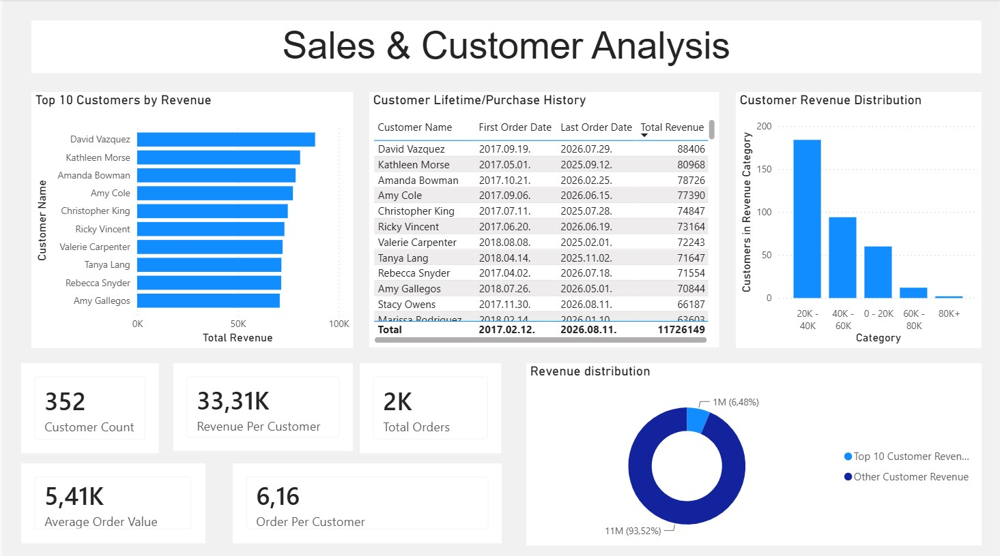

## This portfolio contains projects demonstrating my skills in data preparation, database management, data analysis, and visualization.

---

## Skills

- **SQL** — Data querying, joins, aggregations, filtering
- **MySQL** — Relational database design, data management and analysis
- **Power BI** — Interactive dashboards, data visualization and DAX
- **Excel** — Data analysis and reporting
- **Python** — Synthetic data generation and basic data processing

---

# Projects

## Sales Data Analysis

**Tools:** Python, MySQL, SQL, Power BI

An end-to-end data analytics project built using a fictional sales database.

The project was independently designed and developed from the initial data model and database structure through data generation, SQL analysis, and Power BI visualization.

The main objective of the project is to demonstrate how raw data can be transformed into structured information and ultimately used to answer business questions through data analysis and visualization.

### Business Questions

The project focuses on answering questions such as:

- How are sales developing over time?
- How does revenue change across different years and months?
- Which products generate the most revenue?
- Which customers generate the highest revenue?
- How is revenue distributed across the customer base?
- How many orders and how much revenue does each customer generate?
- What is the Average Order Value (AOV)?
- What does customer purchasing history look like?
- How concentrated is revenue among high-value customers?

---

## Project Workflow

The project follows an end-to-end data analytics workflow:

**Data Generation & Collection**  
↓  
**Data Preparation**  
↓  
**Relational Database Design**  
↓  
**MySQL Database**  
↓  
**SQL Analysis**  
↓  
**Power BI**  
↓  
**Interactive Dashboards**  
↓  
**Business Insights**

The complete workflow was designed and implemented independently, from the initial relational database structure to the final Power BI dashboards.

---

## Data Generation & Sources

The dataset used in this project is fictional and was created specifically for analytical purposes.

Different methods were used to generate and prepare the data.

### Python & Faker

Python and the Faker library were used to generate synthetic data for several entities, including:

- Customers
- Employees
- Suppliers
- Orders
- Supporting business data

The generated data was exported into CSV files and used to populate the relational database.

### Kaggle Dataset

A dataset obtained from Kaggle was used as a source for product-related information, particularly product names.

The relevant data was cleaned and transformed before being incorporated into the project's dataset.

### SQL & CSV Import

Some smaller datasets and business information were entered directly using SQL `INSERT` statements.

CSV files generated or prepared during the data generation process were then imported into the MySQL database.

This resulted in a dataset created through a combination of Python-generated synthetic data, externally sourced data, manually defined business information, and CSV-based data import.

---

## Relational Database Design

I designed and implemented the relational database from the initial concept through to the final implementation.

The database contains tables representing:

- Employees
- Departments
- Customers
- Orders
- Order Items
- Products
- Suppliers
- Warehouses
- Warehouse Stock

The database structure was designed using primary keys, foreign keys, and relationships between entities to create a consistent relational data model.

The database schema can be found in:

`SQL/Schema.sql`

### Database Relationships



---

## SQL Analysis

After creating and populating the relational database, SQL was used to perform analytical queries on the dataset.

The analysis includes:

- Revenue analysis
- Yearly and monthly sales analysis
- Order analysis
- Product performance analysis
- Customer revenue analysis
- Revenue per customer
- Orders per customer
- Average Order Value (AOV)
- Customer purchasing history
- Customer revenue distribution
- Top-performing products
- Revenue concentration among high-value customers

The SQL queries used for the analysis can be found in:

`SQL/Queries.sql`

---

# Power BI Dashboards

The MySQL database was connected directly to Power BI, allowing the data to be analyzed and presented through interactive dashboards.

Two dashboards were created, each focusing on a different aspect of the business.

## Sales Overview



The Sales Overview dashboard provides an overview of revenue and order performance across different time periods.

It includes interactive filtering by year and month and provides insights into overall sales development.

Key elements include:

- Revenue performance
- Order volume
- Yearly sales analysis
- Monthly sales analysis
- Product performance
- Top 5 products
- Interactive filtering

---

## Sales & Customer Analysis



The Sales & Customer Analysis dashboard focuses on customer revenue, purchasing behavior, and customer value.

Key metrics and visualizations include:

- Top 10 customers by revenue
- Customer lifetime and purchase history
- Customer revenue distribution
- Total orders per customer
- Revenue per customer
- Average Order Value (AOV)
- Customer count
- Revenue distribution between the Top 10 customers and the remaining customer base

The dashboard allows users to explore customer-level performance and identify high-value customers and purchasing patterns.

---

## Tools & Technologies

| Tool | Purpose |
|---|---|
| Python | Synthetic data generation and data preparation |
| Faker | Generating realistic fictional records |
| CSV | Data exchange and database population |
| MySQL | Relational database design and data storage |
| SQL | Data querying and analysis |
| Power BI | Data visualization and interactive dashboards |
| DAX | Measures and analytical calculations |
| Excel | Data preparation and supporting analysis |

---

## Repository Structure

```text
data-analytics-portfolio/
│
├── Data/
│   ├── customer.csv
│   ├── employees.csv
│   ├── orders.csv
│   ├── order_items.csv
│   ├── products.csv
│   ├── suppliers.csv
│   └── warehouse_stock.csv
│
├── images/
│   ├── dashboard1.jpg
│   ├── dashboard2.jpg
│   └── table_relations.jpg
│
├── Python/
│   └── generate_data.py
│
├── SQL/
│   ├── Schema.sql
│   ├── Inserting_data.sql
│   └── Queries.sql
│
├── PowerBI/
│   └── Sales_Analysis.pbix
│
└── README.md
```

## Project Objective

The overall objective of this project was to demonstrate the complete data analytics process, rather than focusing solely on the final visualizations.
The project covers the full workflow:
Data generation → Data preparation → Relational database design → MySQL → SQL analysis → Power BI → Business questions → Data-driven insights
Through this project, I aimed to demonstrate practical experience in transforming raw and heterogeneous data into structured, queryable information and ultimately into meaningful business insights.
